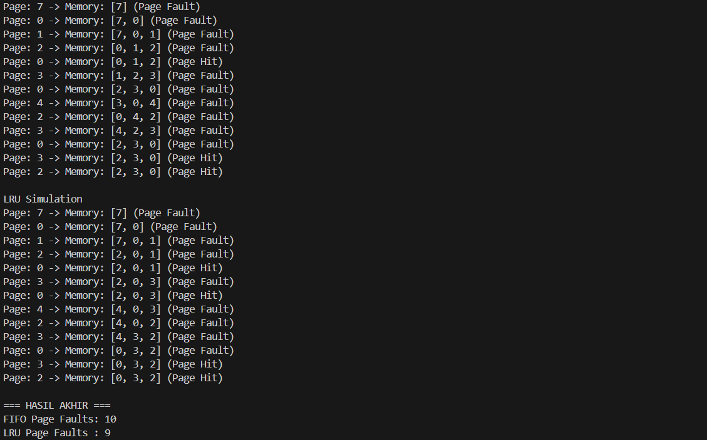

# Laporan Praktikum Minggu 10
Topik: Manajemen Memori – Page Replacement (FIFO & LRU)

---

## Identitas
- **Nama**  : Faris Azhar 
- **NIM**   : 250202978  
- **Kelas** : 1 IKRA

---

## Tujuan
Setelah menyelesaikan tugas ini, mahasiswa mampu:
1. Mengimplementasikan algoritma page replacement FIFO dalam program.
2. Mengimplementasikan algoritma page replacement LRU dalam program.
3. Menjalankan simulasi page replacement dengan dataset tertentu.
4. Membandingkan performa FIFO dan LRU berdasarkan jumlah *page fault*.
5. Menyajikan hasil simulasi dalam laporan yang sistematis.


---

## Dasar Teori
Dasar Teori

Memori virtual adalah mekanisme manajemen memori yang memungkinkan sistem operasi menjalankan program seolah-olah memiliki memori utama lebih besar dari kapasitas fisik yang tersedia, dengan memanfaatkan penyimpanan sekunder.

Page replacement merupakan teknik yang digunakan sistem operasi untuk menentukan halaman (page) mana yang harus diganti ketika terjadi page fault dan memori utama telah penuh.

Algoritma FIFO (First-In First-Out) mengganti halaman berdasarkan urutan masuk pertama ke memori tanpa mempertimbangkan frekuensi atau waktu penggunaan halaman tersebut.

Algoritma LRU (Least Recently Used) mengganti halaman yang paling lama tidak digunakan, dengan asumsi bahwa halaman yang baru digunakan kemungkinan besar akan digunakan kembali.

Kinerja algoritma page replacement diukur berdasarkan jumlah page fault, di mana semakin sedikit page fault maka semakin efisien penggunaan memori.
---

## Langkah Praktikum
1. **Menyiapkan Dataset**

   Gunakan *reference string* berikut sebagai contoh:
   ```
   7, 0, 1, 2, 0, 3, 0, 4, 2, 3, 0, 3, 2
   ```
   Jumlah frame memori: **3 frame**.

2. **Implementasi FIFO**

   - Simulasikan penggantian halaman menggunakan algoritma FIFO.
   - Catat setiap *page hit* dan *page fault*.
   - Hitung total *page fault*.

3. **Implementasi LRU**

   - Simulasikan penggantian halaman menggunakan algoritma LRU.
   - Catat setiap *page hit* dan *page fault*.
   - Hitung total *page fault*.

4. **Eksekusi & Validasi**

   - Jalankan program untuk FIFO dan LRU.
   - Pastikan hasil simulasi logis dan konsisten.
   - Simpan screenshot hasil eksekusi.

5. **Analisis Perbandingan**

   Buat tabel perbandingan seperti berikut:

   | Algoritma | Jumlah Page Fault | Keterangan |
   |:--|:--:|:--|
   | FIFO | ... | ... |
   | LRU | ... | ... |

---

## Kode / Perintah
Tuliskan potongan kode atau perintah utama:
```bash
uname -a
lsmod | head
dmesg | head
```

---

## Hasil Eksekusi
Sertakan screenshot hasil percobaan atau diagram:


---


## Hasil Simulasi

| Algoritma | Jumlah Page Fault | Keterangan                                         |
| --------- | ----------------- | -------------------------------------------------- |
| FIFO      | **10**            | Mengganti halaman berdasarkan urutan masuk         |
| LRU       | **9**             | Mengganti halaman yang paling lama tidak digunakan |

---


## Analisis
🔹 Mengapa jumlah page fault berbeda?

FIFO tidak memperhatikan apakah halaman masih sering digunakan atau tidak.

LRU mempertimbangkan histori penggunaan halaman, sehingga halaman yang sering dipakai tetap dipertahankan.

🔹 Algoritma yang lebih efisien

LRU lebih efisien karena:

Mengurangi kemungkinan mengganti halaman yang akan segera digunakan kembali

Lebih mendekati pola akses memori nyata
---

## Kesimpulan
Kesimpulan

Algoritma FIFO dan LRU dapat diimplementasikan untuk mensimulasikan proses page replacement pada manajemen memori virtual.

Berdasarkan hasil simulasi, algoritma LRU menghasilkan jumlah page fault yang lebih sedikit dibandingkan FIFO, sehingga lebih efisien dalam penggunaan memori.

Pemilihan algoritma page replacement yang tepat berpengaruh besar terhadap kinerja sistem, terutama dalam mengurangi frekuensi terjadinya page fault.

---

## Quiz
1. Apa perbedaan utama FIFO dan LRU?

FIFO mengganti halaman berdasarkan urutan kedatangan pertama, sedangkan LRU mengganti halaman yang paling lama tidak digunakan.

2. Mengapa FIFO dapat menghasilkan Belady’s Anomaly?

Karena FIFO tidak mempertimbangkan pola penggunaan halaman, penambahan jumlah frame justru bisa meningkatkan jumlah page fault.

3. Mengapa LRU umumnya menghasilkan performa lebih baik dibanding FIFO?

Karena LRU menggunakan prinsip locality of reference, sehingga halaman yang sering digunakan tetap berada di memori lebih lama.

---

## Refleksi Diri
Tuliskan secara singkat:
- Apa bagian yang paling menantang minggu ini?  
- Bagaimana cara Anda mengatasinya?  

---

**Credit:**  
_Template laporan praktikum Sistem Operasi (SO-202501) – Universitas Putra Bangsa_
