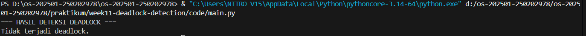

# Laporan Praktikum Minggu 11
Topik: Simulasi dan Deteksi Deadlock
---

## Identitas
- **Nama**  : Faris Azhar 
- **NIM**   : 250202978  
- **Kelas** : 1 IKRA

---

## Tujuan
Setelah menyelesaikan tugas ini, mahasiswa mampu:
1. Membuat program sederhana untuk mendeteksi deadlock.  
2. Menjalankan simulasi deteksi deadlock dengan dataset uji.  
3. Menyajikan hasil analisis deadlock dalam bentuk tabel.  
4. Memberikan interpretasi hasil uji secara logis dan sistematis.  
5. Menyusun laporan praktikum sesuai format yang ditentukan..

---

## Dasar Teori
1. Pengertian Deadlock
Deadlock adalah kondisi dalam sistem operasi di mana dua atau lebih proses saling menunggu resource yang sedang digunakan oleh proses lain, sehingga tidak ada proses yang dapat melanjutkan eksekusi. Deadlock membuat sebagian atau seluruh proses terhenti secara permanen hingga intervensi dilakukan.

---

## Langkah Praktikum
1. **Menyiapkan Dataset**

   Gunakan dataset sederhana yang berisi:
   - Daftar proses  
   - Resource Allocation  
   - Resource Request / Need

   Contoh tabel:

   | Proses | Allocation | Request |
   |:--:|:--:|:--:|
   | P1 | R1 | R2 |
   | P2 | R2 | R3 |
   | P3 | R3 | R1 |

2. **Implementasi Algoritma Deteksi Deadlock**

   Program minimal harus:
   - Membaca data proses dan resource.  
   - Menentukan apakah sistem berada dalam kondisi deadlock.  
   - Menampilkan proses mana saja yang terlibat deadlock.

3. **Eksekusi & Validasi**

   - Jalankan program dengan dataset uji.  
   - Validasi hasil deteksi dengan analisis manual/logis.  
   - Simpan hasil eksekusi dalam bentuk screenshot.

4. **Analisis Hasil**

   - Sajikan hasil deteksi dalam tabel (proses deadlock / tidak).  
   - Jelaskan mengapa deadlock terjadi atau tidak terjadi.  
   - Kaitkan hasil dengan teori deadlock (empat kondisi).

---

## Kode / Perintah
Tuliskan potongan kode atau perintah utama:
```bash
uname -a
lsmod | head
dmesg | head
```

---

## Hasil Eksekusi
Sertakan screenshot hasil percobaan atau diagram:


---

## Analisis

### Tabel Analisis Deadlock

| Proses| Status |
|:-----:|:------:|
| P1    | Deadlock |
| P2    | Deadlock |
| P3    | Deadlock |

### Analisis Logis

Deadlock terjadi karena seluruh **empat kondisi deadlock** terpenuhi:
1. **Mutual Exclusion**  
   Setiap resource hanya dapat digunakan oleh satu proses dalam satu waktu.
2. **Hold and Wait**  
   Setiap proses memegang satu resource dan menunggu resource lain.
3. **No Preemption**  
   Resource tidak dapat diambil secara paksa dari proses lain.
4. **Circular Wait**  
   Terjadi siklus: P1 → P2 → P3 → P1.

Karena seluruh kondisi terpenuhi, sistem berada dalam kondisi deadlock.l di lingkungan OS berbeda (Linux vs Windows)?  

---

## Kesimpulan
Berdasarkan simulasi yang dilakukan, dapat disimpulkan bahwa:
1. Algoritma deteksi deadlock berhasil mengidentifikasi kondisi deadlock.
2. Pendekatan wait-for graph efektif untuk mendeteksi siklus antar proses.
3. Deteksi deadlock penting untuk sistem yang tidak menerapkan pencegahan atau penghindaran deadlock.
4. Proses-proses yang terlibat deadlock dapat diidentifikasi secara jelas.


---

## Quiz
### 1. Apa perbedaan antara deadlock prevention, avoidance, dan detection?

- **Deadlock Prevention**: Mencegah deadlock dengan menghilangkan salah satu dari empat kondisi deadlock.
- **Deadlock Avoidance**: Menghindari deadlock dengan memastikan sistem selalu berada dalam keadaan aman (safe state), contohnya algoritma Banker.
- **Deadlock Detection**: Membiarkan deadlock terjadi, kemudian mendeteksinya dan melakukan pemulihan.

---

### 2. Mengapa deteksi deadlock tetap diperlukan dalam sistem operasi?

Karena tidak semua sistem dapat menerapkan pencegahan atau penghindaran deadlock akibat keterbatasan performa dan fleksibilitas. Deteksi deadlock memungkinkan sistem berjalan lebih bebas dan hanya menangani deadlock ketika benar-benar terjadi.

---

### 3. Apa kelebihan dan kekurangan pendekatan deteksi deadlock?

**Kelebihan:**
- Sistem lebih fleksibel.
- Tidak membatasi penggunaan resource sejak awal.
- Cocok untuk sistem berskala besar.

**Kekurangan:**
- Deadlock tetap dapat terjadi.
- Membutuhkan mekanisme tambahan untuk pemulihan.
- Deteksi dapat memakan overhead komputasi.

---

## Refleksi Diri
Tuliskan secara singkat:
- Apa bagian yang paling menantang minggu ini?  
- Bagaimana cara Anda mengatasinya?  

---

**Credit:**  
_Template laporan praktikum Sistem Operasi (SO-202501) – Universitas Putra Bangsa_
