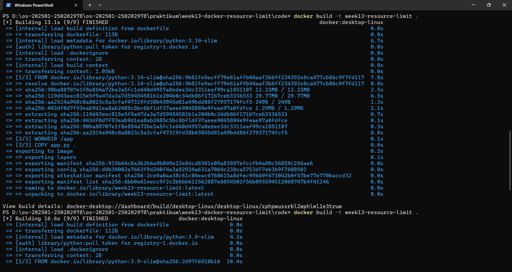
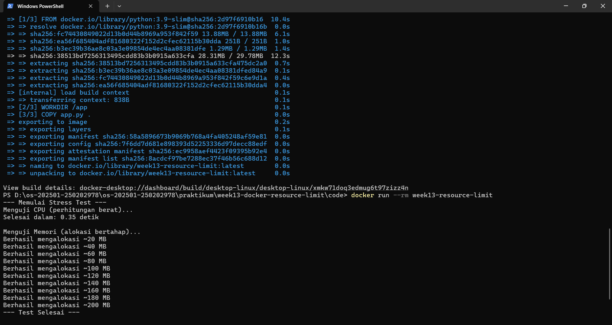

# Laporan Praktikum Minggu 13
Topik: Docker – Resource Limit (CPU & Memori)

---

## Identitas
- **Nama**  : Faris Azhar
- **NIM**   : 250202978
- **Kelas** : 1 IKRA

---

## Tujuan
Setelah menyelesaikan tugas ini, mahasiswa mampu:
1. Menulis Dockerfile sederhana untuk sebuah aplikasi/skrip.
2. Membangun image dan menjalankan container.
3. Menjalankan container dengan pembatasan **CPU** dan **memori**.
4. Mengamati dan menjelaskan perbedaan eksekusi container dengan dan tanpa limit resource.
5. Menyusun laporan praktikum secara runtut dan sistematis.
---

## Dasar Teori

Docker adalah platform containerisasi yang memungkinkan aplikasi dijalankan secara terisolasi dalam sebuah container. Salah satu keunggulan utama Docker adalah kemampuannya dalam mengatur dan membatasi penggunaan sumber daya sistem, seperti CPU dan memori, agar setiap container tidak saling mengganggu kinerja container lain maupun sistem host.

1. Resource Limit pada Docker

Resource limit adalah mekanisme pembatasan penggunaan sumber daya yang dapat dipakai oleh sebuah container. Docker memanfaatkan fitur bawaan kernel Linux yang disebut Control Groups (cgroups) untuk mengatur dan memonitor penggunaan CPU, memori, dan resource lainnya.

Dengan resource limit, administrator atau developer dapat:

Mencegah container menggunakan resource secara berlebihan

Menjaga stabilitas sistem

Mengoptimalkan penggunaan server

2. Pembatasan CPU pada Docker

Pembatasan CPU digunakan untuk mengatur seberapa besar kapasitas prosesor yang dapat digunakan oleh sebuah container. Docker menyediakan beberapa cara untuk membatasi CPU, di antaranya:

CPU shares: Menentukan prioritas CPU relatif antar container

CPU quota: Membatasi waktu CPU yang boleh digunakan dalam satu periode tertentu

CPU core: Menentukan core CPU tertentu yang boleh digunakan container

Dengan pembatasan CPU, container tidak akan memonopoli prosesor meskipun sedang menjalankan proses berat.

3. Pembatasan Memori pada Docker

Pembatasan memori bertujuan untuk mengontrol jumlah RAM yang dapat digunakan oleh container. Docker memungkinkan pengaturan batas maksimal memori yang boleh digunakan oleh sebuah container.

Jika container melebihi batas memori yang ditentukan, maka:

Container dapat dihentikan secara otomatis (OOM – Out of Memory)

Sistem host tetap aman dan stabil

Pembatasan memori sangat penting untuk mencegah memory leak pada aplikasi yang berjalan di dalam container.

4. Manfaat Resource Limit

Penerapan resource limit pada Docker memberikan berbagai manfaat, antara lain:

Meningkatkan efisiensi penggunaan sumber daya

Menjaga performa aplikasi lain yang berjalan di server

Mendukung lingkungan multi-container

Mempermudah manajemen dan monitoring sistem

---

## Langkah Praktikum
   - Tulis `Dockerfile` untuk menjalankan program uji.
   - Build image:
     ```bash
     docker build -t week13-resource-limit .
     ```

4. **Menjalankan Container Tanpa Limit**

   - Jalankan container normal:
     ```bash
     docker run --rm week13-resource-limit
     ```
   - Catat output/hasil pengamatan.

5. **Menjalankan Container Dengan Limit Resource**

   Jalankan container dengan batasan resource (contoh):
   ```bash
   docker run --rm --cpus="0.5" --memory="256m" week13-resource-limit
   ```
   Catat perubahan perilaku program (mis. lebih lambat, error saat memori tidak cukup, dll.).

6. **Monitoring Sederhana**

   - Jalankan container (tanpa `--rm` jika perlu) dan amati penggunaan resource:
     ```bash
     docker stats
     ```
   - Ambil screenshot output eksekusi dan/atau `docker stats`.
---

## Kode / Perintah
Tuliskan potongan kode atau perintah utama:
```bash
import time

def stress_test():
    print("--- Memulai Stress Test ---")
    
    # 1. Uji CPU (Menghitung angka besar)
    print("Menguji CPU (perhitungan berat)...")
    start = time.time()
    for i in range(10**7):
        _ = i * i
    print(f"Selesai dalam: {time.time() - start:.2f} detik\n")

    # 2. Uji Memori (Alokasi bertahap)
    print("Menguji Memori (alokasi bertahap)...")
    data = []
    try:
        for i in range(1, 11):
            # Alokasi sekitar 20MB setiap tahap
            data.append(' ' * (20 * 1024 * 1024))
            print(f"Berhasil mengalokasi ~{i * 20} MB")
            time.sleep(1)
    except MemoryError:
        print("Error: Memori tidak cukup!")
    
    print("--- Test Selesai ---")

if __name__ == "__main__":
    stress_test()
```
---

## Hasil Eksekusi
Sertakan screenshot hasil percobaan atau diagram:



---

## Analisis
Berdasarkan hasil percobaan yang dilakukan, dapat diamati bahwa penggunaan resource limit pada Docker memberikan pengaruh nyata terhadap perilaku eksekusi aplikasi di dalam container.

Pada saat container dijalankan tanpa limit resource, proses komputasi CPU berjalan lebih cepat karena container dapat menggunakan seluruh kapasitas CPU yang tersedia pada host. Proses perhitungan selesai dalam waktu yang relatif singkat, dan alokasi memori dapat terus bertambah tanpa hambatan selama masih tersedia RAM di sistem host.

Sebaliknya, ketika container dijalankan dengan limit CPU (--cpus="0.5"), waktu eksekusi komputasi menjadi lebih lambat. Hal ini terjadi karena kernel Linux melalui mekanisme cgroups membatasi jatah waktu CPU yang boleh digunakan oleh container. Akibatnya, proses perhitungan harus menunggu giliran eksekusi CPU, sehingga durasi program meningkat.

Pada pengujian limit memori (--memory="256m"), alokasi memori bertahap menunjukkan perilaku yang berbeda. Ketika penggunaan memori mendekati atau melebihi batas yang ditentukan, container dapat mengalami kegagalan alokasi memori atau dihentikan oleh sistem dengan mekanisme OOM (Out of Memory Killer). Hal ini membuktikan bahwa Docker mampu melindungi sistem host dari aplikasi yang boros memori.

---

## Kesimpulan
Tuliskan 2–3 poin kesimpulan dari praktikum ini.

1.Docker mampu membatasi penggunaan CPU dan memori container secara efektif dengan memanfaatkan fitur cgroups pada kernel Linux.

2.Penerapan resource limit mempengaruhi performa aplikasi, terutama pada proses komputasi berat dan alokasi memori besar.

3.Resource limit sangat penting untuk menjaga stabilitas sistem host dan mencegah satu container mendominasi seluruh sumber daya.

---

## Quiz
1. Mengapa container perlu dibatasi CPU dan memori?
Container perlu dibatasi CPU dan memori agar tidak menggunakan sumber daya sistem secara berlebihan. Pembatasan ini menjaga kestabilan sistem host, mencegah satu container mengganggu container lain, serta meningkatkan efisiensi dan keandalan lingkungan multi-container.
2. Apa perbedaan VM dan container dalam konteks isolasi resource?
Virtual Machine (VM) melakukan isolasi resource melalui virtualisasi hardware dan menjalankan sistem operasi sendiri, sehingga membutuhkan resource lebih besar. Container berbagi kernel sistem operasi host dan hanya mengisolasi aplikasi serta dependensinya, sehingga lebih ringan dan efisien, namun tetap dapat dibatasi resource-nya menggunakan cgroups.
3. Apa dampak limit memori terhadap aplikasi yang boros memori?
Aplikasi yang boros memori dapat mengalami kegagalan alokasi memori atau dihentikan secara otomatis oleh sistem (OOM Killer) jika melebihi batas memori yang ditentukan. Hal ini mencegah aplikasi tersebut merusak stabilitas sistem secara keseluruhan.

---

## Refleksi Diri
Tuliskan secara singkat:
- Apa bagian yang paling menantang minggu ini? 
- Bagaimana cara Anda mengatasinya?  

---

**Credit:**  
_Template laporan praktikum Sistem Operasi (SO-202501) – Universitas Putra Bangsa_
