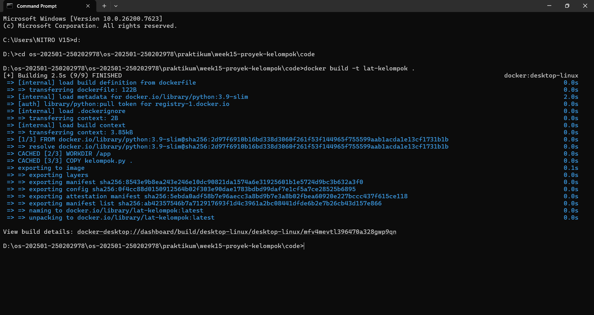
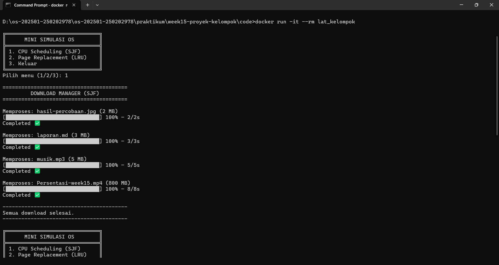

# Laporan Praktikum Minggu 15
Mini Simulasi Sistem Operasi

---

## Identitas
**Nama Anggota Kelompok 5**  :
1. Faris Azhar (250202978)
2. Muhammad Reza Pahlevi (250202995)
3. Ammarudin Ibnu Salam (250202929)
4. Tri Agustin Wahyuningtyas (250202970)
5. Keysya Ayu Anggita (250202944)

**Kelas** : 1 IKRA 

---

## 1. Pendahuluan

### 1.1. Latar Belakang

Sistem operasi merupakan komponen perangkat lunak fundamental yang berfungsi sebagai jembatan antara pengguna, aplikasi, dan perangkat keras komputer. Dalam perkembangan teknologi informasi yang sangat pesat, efisiensi pengelolaan sumber daya daya komputasi menjadi tantangan utama. Dua pilar utama dalam efisiensi ini adalah manajemen waktu melalui Penjadwalan CPU (CPU Scheduling) dan manajemen ruang melalui Manajemen Memori (Memory Management).

Penjadwalan CPU yang tepat memastikan bahwa setiap proses mendapatkan jatah waktu eksekusi yang adil dan responsif, sementara manajemen memori memastikan bahwa pemakaian RAM dilakukan secara optimal tanpa menyebabkan sistem menjadi lambat atau crash. Tanpa mekanisme ini, multitasking yang lancar pada komputer modern tidak mungkin tercapai.

Lebih jauh lagi, tren teknologi saat ini telah bergeser ke arah efisiensi tingkat tinggi melalui Teknologi Kontainer (Containerization). Berbeda dengan virtualisasi tradisional yang berat, kontainer memungkinkan isolasi sumber daya bagi aplikasi dengan menggunakan kernel sistem operasi yang sama secara bersama-sama. Hal ini menciptakan kebutuhan bagi para praktisi IT untuk memahami bagaimana batasan sumber daya (resource limit) diterapkan pada suatu proses di dalam lingkungan yang terisolasi.

Namun, mempelajari cara kerja internal sistem operasi secara langsung pada kernel aslinya seringkali sulit dilakukan karena kompleksitas kode dan risiko kegagalan sistem yang nyata. Oleh karena itu, pembuatan Mini Simulasi Sistem Operasi menjadi sangat relevan. Simulasi ini dirancang untuk memodelkan interaksi antara algoritma penjadwalan, alokasi memori, dan isolasi kontainer dalam lingkungan yang terkendali.

Melalui proyek ini, kelompok kami berupaya untuk mengintegrasikan ketiga konsep tersebut ke dalam satu aplikasi simulasi tunggal. Proyek ini tidak hanya bertujuan untuk memenuhi tugas akademis, tetapi juga untuk memberikan gambaran konkret mengenai bagaimana sebuah sistem operasi modern mengatur antrean proses, mengalokasikan RAM, dan menerapkan batasan sumber daya pada setiap unit kontainer.


### 1.2. Tujuan
1. ⁠Mahasiswa mampu bekerja secara kolaboratif dalam tim melalui implementasi pembagian peran dan tanggung jawab yang terstruktur, seperti Project Lead,              Developer, dan Documentation/QA.
2. ⁠Mahasiswa mampu melakukan implementasi dan integrasi konsep sistem operasi, yaitu penjadwalan CPU dan manajemen memori, ke dalam satu aplikasi terpadu.
3. Mahasiswa dapat mengelola kode program menggunakan sistem pengendalian versi Git secara terstruktur, termasuk penerapan branching dan merge request dengan        baik.
4. ⁠Mahasiswa mampu melakukan containerization aplikasi menggunakan Docker sehingga aplikasi dapat dijalankan dan didemonstrasikan secara konsisten di berbagai       lingkungan sistem operasi.
5. ⁠Mahasiswa mampu menyusun laporan teknis secara sistematis serta mempresentasikan hasil pengujian aplikasi dengan jelas.

---

Struktur folder:
```bash
week15-proyek-kelompok
 ┣ code
 ┃ ┣ data
 ┃ ┃ ┗ database
 ┃ ┣ CPU.py
 ┃ ┣ dockerfile
 ┃ ┣ example.txt
 ┃ ┣ kelompok.py
 ┃ ┗ LRU.py
 ┣ screenshots
 ┃ ┣ cpuscheduling.png
 ┃ ┣ dockerbuild.png
 ┃ ┣ example.png
 ┃ ┣ keluar.png
 ┃ ┗ pagereplacemen.png
 ┣ laporan.md
 ┗ presentasi.md
```

## 2. Arsitektur Aplikasi
### 2.1. Deskripsi Sistem
Mini simulasi ini menampilkan dua konsep utama dalam sistem operasi, yaitu CPU scheduling dan page replacement, dengan tujuan membantu pengguna memahami pengelolaan proses serta penggunaan memori secara praktis. Sistem ini tersusun dari beberapa komponen inti yang saling berinteraksi untuk menjalankan fungsinya.
* **Input Module(`main.py`):** Modul ini bertugas menerima input dari pengguna, seperti daftar proses beserta burst time, prioritas, atau ukuran memori yang diperlukan. Input ini menjadi dasar bagi modul lainnya untuk menjalankan simulasi.
* **CPU Scheduling Module(`cpu_scheduling.py`):** Modul ini bertanggung jawab mengatur urutan eksekusi proses berdasarkan algoritma tertentu, misalnya Round Robin, FCFS, atau Priority Scheduling. Selain itu, modul ini menghitung waktu tunggu (waiting time) dan waktu penyelesaian (turnaround time) dari tiap proses.
* **Page Replacement(`page_replacement.py`):** Modul ini mensimulasikan pengelolaan memori dan penggantian halaman ketika memori penuh, menggunakan algoritma seperti FIFO atau LRU, sehingga pengguna bisa melihat bagaimana sistem menangani keterbatasan memori.
* **Output / Display Module(`main.py`):** Modul ini menampilkan hasil simulasi, termasuk urutan eksekusi proses, status memori, penggantian halaman, serta rasio keberhasilan akses halaman memori.
* **Controller / Environment:** Modul ini mengatur alur data antar modul, sehingga setiap modul dapat diuji secara terpisah atau dijalankan bersamaan untuk mensimulasikan mini sistem operasi secara menyeluruh.

Alur data dimulai dari input yang diterima pengguna, kemudian diproses oleh modul CPU Scheduling, dilanjutkan ke modul Page Replacement untuk pengelolaan memori, dan akhirnya ditampilkan melalui modul Output. Controller memastikan seluruh modul berinteraksi dengan lancar dan integrasi simulasi berjalan dengan baik. Dengan struktur ini, sistem dapat dijalankan secara modular maupun sebagai simulasi lengkap, memudahkan pengujian, visualisasi, dan analisis hasil.

##
### 2.2. Modul Data
**1. Modul CPU Scheduling (SJF)**

Modul ini mensimulasi algoritma penjadwalan proses **Shortest Job First (SJF)** untuk menentukan urutan eksekusi proses berdasarkan waktu eksekusi terpendek. 

**Input Data:** Daftar proses yang memuat informasi waktu kedatangan (*Arrival Time*) dan waktu eksekusi (*Burst Time*).

**Logika Proses:**
1. Sistem membaca seluruh data proses yang tersedia.
2. Proses yang telah tiba dipilih berdasarkan waktu eksekusi paling kecil.
3. Proses dijalankan hingga selesai sebelum sistem melanjutkan ke proses berikutnya (*non-preemptive*).
4. Sistem menghitung waktu tunggu (*waiting time*) dan waktu penyelesaian setiap proses

**Output:** Tabel hasil penjadwalan yang menampilkan urutan eksekusi proses serta rata-rata waktu tunggu.
##

**2. Modul Page Replacement (LRU)**

Modul ini mensimulasikan algoritma manajemen memori **Least Recently Used (LRU)** untuk menentukan halaman yang digantikan berdasarkan riwayat penggunaan.

**Input Data:** Urutan referensi halaman dan kapasitas memori (jumlah frame) yang ditentukan oleh pengguna.

**Logika Proses:**
1. Sistem membaca urutan referensi halaman secara berurutan.
2. Setiap halaman yang diakses diperiksa keberadaannya di dalam memori.
3. Jika halaman sudah ada di memori
   - Status: Berhasil diakses (hit)
   - Halaman diperbarui sebagai yang paling baru digunakan.
4. Jika halaman tidak ada memori:
   - Status: Gagal diakses (fault)
   - Jika memori penuh, halaman yang paling lama tidak digunakan akan dikeluarkan.
5. Halaman baru dimasukkan ke dalam memori.

**Output:** Tabel visualisasi isi memori pada setiap langkah serta total keberhasilan dan kegagalan akses halaman.
##

### 2.3. Alur Data
**1. Alur Data Modul CPU Scheduling (SJF)**
- Pengguna memasukkan daftar proses beserta waktu eksekusi.
- Sistem menyimpan data ke proses ke dalam antrean proses.
- Sistem membandingkan waktu eksekusi setiap proses.
- Proses dengan waktu eksekusi paling singkat dipilih untuk dijalankan.
- Proses eksekusi hingga selesai tanpa interupsi.
- Sistem menampilkan status eksekusi setiap proses hingga seluruh proses selesai.

**2. Alur Data Modul Page Replacement (LRU)**
- Pengguna menentukan kapasitas memori (jumlah frame).
- Sistem membaca urutan referensi halaman.
- Setiap referensi halaman diperiksa keberadaannya di dalam memori.
- Jika halaman tersedia di memori:
  * Sistem mencatat kondisi (**Hit**)
  * Posisi halaman diperbarui sebagai halaman yang paling baru digunakan
- Jika halaman tidak tersedia di memori:
  * Sistem mencatat kondisi **Page Fault**
  * Jika memori penuh, halaman yang paling lama tidak digunakan dikeluarkan
  * Halaman baru dimasukkan ke dalam memori.
- Sistem menampilkan status isi memori pada setiap langkah.

---

## 3. Demo Langsung Menjalankan Aplikasi
Untuk memastikan aplikasi yang dikembangkan dapat berjalan dengan baik serta sesuai dengan tujuan praktikum, dilakukan pengujian dengan menjalankan aplikasi secara langsung menggunakan teknologi Docker. Pengujian ini bertujuan untuk menunjukkan bahwa aplikasi dapat dieksekusi dalam lingkungan yang terisolasi dan konsisten tanpa bergantung pada konfigurasi sistem host.
Lingkungan uji yang digunakan pada proses demo adalah sebagai berikut:
- SO: Windows
- Docker: Docker Desktop
- Bahasa Pemograman: Python

**3.1. Lingkungan Demo**

Demo aplikasi dijalankan menggunakan Docker Container untuk memastikan aplikasi dapat dieksekusi dengan baik. Konfigurasi lingkungan demo yang digunakan adalah sebagai berikut:
- **Base image:** `python:3.9-slim` (dipilih karena ukurannya lebih ringan dibandingkan image Python standar)
- **Direktori kerja:** `/app` (lokasi utama penyimpanan dan eksekusi kode aplikasi di dalam container)
- **Struktur container:** File program utama `kelompok.py` disalin ke dalam direktori `/app` di dalam container sebagai sumber aplikasi yang akan dijalankan.
- **Perintah eksekusi:** Aplikasi dijalankan dengan perintah python `kelompok.py` saat container dijalankan.
##

**3.2. Prosedur Demo**

**A. Build Image**

Pada tahap ini dilakukan proses build Docker image menggunakan perintah `docker build -t lat-kelompok .`. Proses build berjalan dengan baik tanpa adanya error, dimulai dari pengambilan base image `python:3.9-slim`, penetapan direktori kerja `/app`, hingga penyalinan file `kelompok.py`. Hasil build menunjukkan image berhasil dibuat dengan nama `lat-kelompok:latest`.


##
**B. Tahap Eksekusi**

Setelah image berhasil dibuat, aplikasi dijalankan menggunakan Docker Container dengan perintah `docker run lat-kelompok`. Container mengeksekusi file `kelompok.py` sesuai dengan perintah yang telah ditentukan pada Dockerfile.
##
**C. Tahap Demo Aplikasi**
- **Skenario 1 (CPU Scheduling):**
  Pengguna memilih menu “1” untuk menjalankan simulasi CPU Scheduling menggunakan algoritma Shortest Job First (SJF). Program memproses dan menampilkan urutan      eksekusi proses berdasarkan waktu eksekusi terpendek hingga seluruh proses selesai dijalankan.

- **Skenario 2 (Memory Management / Page Replacement):**
  Pengguna memilih menu “2” untuk menjalankan simulasi Page Replacement menggunakan algoritma Least Recently Used (LRU). Program membaca data halaman dari file     `pages.txt`, kemudian menampilkan proses page hit dan page fault selama simulasi berlangsung. Di akhir simulasi, ditampilkan ringkasan hasil pengelolaan memori.

- **Skenario 3 (Terminasi):**
  Pengguna memilih menu “3” untuk keluar dari program. Aplikasi menampilkan pesan bahwa program telah selesai dijalankan dan berhenti dengan normal.

  ---
## 4. Hasil Pengujian dan Analisis
**4.1. Hasil Pengujian Modul CPU Scheduling - SJF**

Pengujian ini menggunakan dataset antrean unduhan (processes.csv) yang dihasilkan dari simulasi CPU Scheduling algoritma SJF pada Mini Simulasi OS, dengan parameter waktu klik (arrival time) dan durasi unduhan (burst time).

**Tabel hasil cpu sqaduling sjf download manager** 
| Proses | Burst Time | Arrival Time |
|:--:|:--:|:--:|
| Persentasi-week15.mp4 | 8 | 0 |
| hasil-percobaan.jpg | 2 | 1 |
| laporan.md | 3 | 2 |
| musik.mp3 | 5 | 3 |


| Proses                | AT | BT | Start Time | Completion Time (CT) | Waiting Time (WT) | Turnaround Time (TAT) |
| --------------------- | -: | -: | ---------: | -------------------: | ----------------: | --------------------: |
| Persentasi-week15.mp4 |  0 |  8 |          0 |                    8 |                 0 |                     8 |
| hasil-percobaan.jpg   |  1 |  2 |          8 |                   10 |                 7 |                     9 |
| laporan.md            |  2 |  3 |         10 |                   13 |                 8 |                    11 |
| musik.mp3             |  3 |  5 |         13 |                   18 |                10 |                    15 |


Rata-rata Waiting Time (WT)  6,25 detik

Rata-rata Turnaround Time (TAT) 10,75 detik
   
 **Hasil Output:**
   
   

Secara singkat, algoritma **SJF** pada simulasi *download manager* ini mampu menurunkan **rata-rata waktu tunggu (6,25 detik)** dan **turnaround time (10,75 detik)** dengan memprioritaskan proses yang memiliki *burst time* lebih kecil. Meskipun proses pertama tetap dijalankan karena datang lebih awal, SJF tetap efisien dalam meningkatkan respons sistem, namun berpotensi menyebabkan *starvation* pada proses berdurasi panjang.

##
**4.2. Hasil Pengujian Modul Page Replacement - LRU**

**Skenario Pengujian**

Pengujian ini mensimulasikan manajemen RAM browser menggunakan dataset riwayat tab (`pages.txt`) berdasarkan algoritma Least Recently Used (LRU). Urutan akses tab adalah `YouTube, Instagram, WhatsApp, YouTube, Instagram, Spotify, YouTube` dengan kapasitas memori 3 tab (frames). Sistem mencatat page hit dan page fault sesuai prinsip LRU.


**Tabel Simulasi Page Replacement - LRU**

| Step | Page | F1 | F2 | F3 | Status |
| --- | --- | --- | --- | --- | --- |
| 1 | YouTube | YouTube | - | - | Fault |
| 2 | Instagram | YouTube | Instagram | - | Fault |
| 3 | WhatsApp | YouTube | Instagram | WhatsApp | Fault |
| 4 | YouTube | Instagram | WhatsApp | YouTube | Hit |
| 5 | Instagram | WhatsApp | YouTube | Instagram | Hit |
| 6 | Spotify | YouTube | Instagram | Spotify| Fault |
| 7 | YouTube | Instagram | Spotify | YouTube | Hit |

**Metrik Akhir:**
- Total aplikasi yang diakses: 7 Aplikasi
- Total page fault: 4 kali
- Page hit: 3 kali

**Analisis Kinerja:**
- Pola akses berulang pada halaman **YouTube** dan **Instagram** menghasilkan **page hit**, karena halaman tersebut masih tersimpan di memori.
- Algoritma LRU menghasilkan hit ratio sebesar 0,43, yang menunjukkan bahwa sebagian akses halaman berhasil ditemukan di memori utama.

---

## 5. Pembagian Peran dan Kontribusi
| Nama Anggota | Peran Utama | Deskripsi Kontribusi |
| --- | --- | --- |
| Faris Azhar |
| Muhammad Reza Pahlevi | 
| Ammarudin Ibnu Salam |
| Tri Agustin Wahyuningtyas |
| Keysya Ayu Anggita |

---
## 6. Quiz dan Penutup
**1. Tantangan terbesar integrasi modul apa, dan bagaimana solusinya?**
Saat menjadi bagian developer 1-3 harus menunggu commit dari leader tesebut dan solusinya yaitu menunggu tanggapan dari leadernya. 
##
**2. Mengapa Docker membantu proses demo dan penilaian proyek?**

Docker memungkinkan penerapan pembatasan sumber daya seperti CPU dan memori pada container. Hal ini relevan dengan konsep sistem operasi yang dipelajari, karena menunjukkan bagaimana proses dapat dibatasi dan dikelola secara terisolasi, sekaligus mencegah aplikasi mengganggu kinerja sistem host saat demo berlangsung.
##
**3. Jika dataset diperbesar 10x, modul mana yang paling terdampak performanya? Jelaskan.**

Jika dataset diperbesar hingga 10 kali lipat, modul yang paling terdampak performanya adalah Modul Page Replacement (LRU). Hal ini disebabkan oleh meningkatnya jumlah referensi halaman yang harus diproses dan dibandingkan secara berurutan untuk menentukan halaman yang paling lama tidak digunakan. Semakin panjang urutan referensi dan semakin sering terjadi pengecekan isi memori, maka overhead komputasi juga meningkat. Sementara itu, modul CPU Scheduling (SJF) relatif lebih stabil karena jumlah proses biasanya lebih terbatas dan proses penjadwalannya dilakukan sekali per siklus. Oleh karena itu, peningkatan skala data lebih signifikan memengaruhi performa modul manajemen memori dibandingkan modul penjadwalan CPU.

---
## Kesimpulan
- Penggunaan Docker memastikan aplikasi dapat dijalankan secara konsisten, terisolasi, dan mudah didemonstrasikan di berbagai lingkungan sistem operasi.
- Algoritma Shortest Job First (SJF) terbukti mampu menurunkan rata-rata waktu tunggu dan turnaround time dengan memprioritaskan proses berdurasi lebih singkat.
- Algoritma Least Recently Used (LRU) efektif dalam mengelola memori dengan mempertahankan halaman yang sering diakses dan meminimalkan page fault.

---

**Credit:**  
_Template laporan praktikum Sistem Operasi (SO-202501) – Universitas Putra Bangsa_
