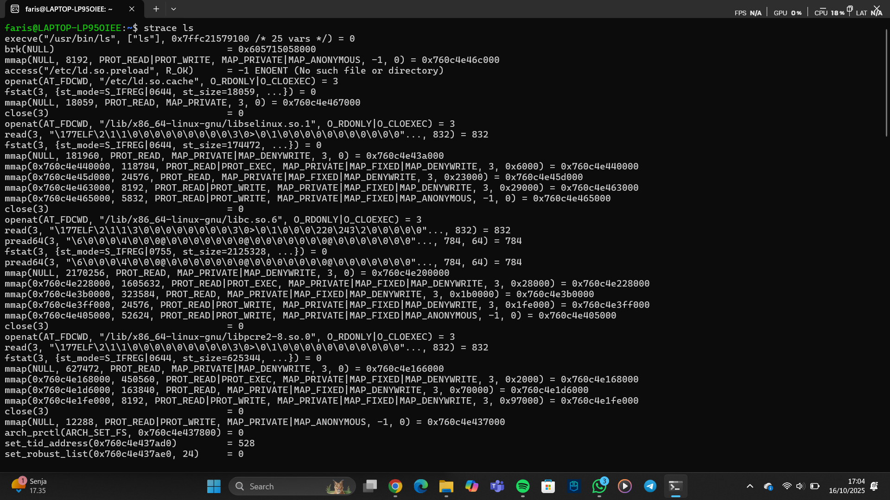

# Laporan Praktikum Minggu 2
Arsitektur Sistem Operasi dan Kernel

---

## Identitas
- **Nama**  : Faris Azhar
- **NIM**   : 250202978 
- **Kelas** : 1IKRA

---

## Tujuan sistem operasi dan peran kernel serta system kernel   
1. Menjelaskan konsep dan fungsi system call dalam sistem operasi.
2. Mengidentifikasi jenis-jenis system call dan fungsinya.
3. Mengamati alur perpindahan mode user ke kernel saat system call terjadi.
4. Menggunakan perintah Linux untuk menampilkan dan menganalisis system call.

## Dasar Teori
Tuliskan ringkasan teori (3–5 poin) yang mendasari percobaan.

---

## Langkah Praktikum
1. **Setup Environment**
   - Gunakan Linux (Ubuntu/WSL).
   - Pastikan perintah `strace` dan `man` sudah terinstal.
   - Konfigurasikan Git (jika belum dilakukan di minggu sebelumnya).

2. **Eksperimen 1 – Analisis System Call**
   Jalankan perintah berikut:
   ```bash
   strace ls
   ```
   > Catat 5–10 system call pertama yang muncul dan jelaskan fungsinya.  
   Simpan hasil analisis ke `results/syscall_ls.txt`.

3. **Eksperimen 2 – Menelusuri System Call File I/O**
   Jalankan:
   ```bash
   strace -e trace=open,read,write,close cat /etc/passwd
   ```
   > Analisis bagaimana file dibuka, dibaca, dan ditutup oleh kernel.

4. **Eksperimen 3 – Mode User vs Kernel**
   Jalankan:
   ```bash
   dmesg | tail -n 10
   ```
   > Amati log kernel yang muncul. Apa bedanya output ini dengan output dari program biasa?

---

## Kode / Perintah
Tuliskan potongan kode atau perintah utama:
```bash
strace ls
bash
strace -e trace=open,read,write,close cat /etc/passwd
bash
strace -e trace=open,read,write,close cat /etc/passwd
```

## Hasil Eksekusi
Screnshoot hasil percobaan dan diagram:




---

## Analisis
- Jelaskan makna hasil percobaan.  
- Hubungkan hasil dengan teori (fungsi kernel, system call, arsitektur OS).  
- Apa perbedaan hasil di lingkungan OS berbeda (Linux vs Windows)?
- 
- 1.Contoh baris strace yang muncul: openat(AT_FDCWD, "/etc/passwd", O_RDONLY) = 3 Proses (cat) meminta kernel membuka path /etc/passwd — modern strace biasanya menampilkan openat bukan open. Flag O_RDONLY berarti hanya baca. Kernel mencari inode lewat VFS (virtual file system). Kernel mengembalikan file descriptor (FD), mis. 3 — angka kecil di atas 0..2 (stdin/stdout/stderr). Peran kernel: memeriksa hak akses, mengikat FD ke struktur file internal (struct file), dan menghubungkannya ke inode dan offset awal (0).
- 1. Fungsi KernelFungsi Kernel adalah inti dari sistem operasi (OS) dan bertanggung jawab untuk mengelola sumber daya sistem dan menyediakan layanan dasar.Fungsi KernelKaitan dengan Hasil yang MungkinManajemen ProsesJika hasilnya menunjukkan waktu respons program atau multitasking yang efisien/lambat. Kinerja ini secara langsung dipengaruhi oleh penjadwalan (scheduling) proses yang dilakukan oleh kernel.Manajemen MemoriJika hasilnya melibatkan penggunaan memori, swapping, atau terjadinya segmentation fault. Kernel mengalokasikan dan melindungi ruang memori antar proses.Manajemen Perangkat Keras (I/O)Jika hasilnya berhubungan dengan kecepatan transfer data dari disk (HDD/SSD), respons perangkat jaringan, atau penggunaan driver. Kernel menyediakan abstraksi perangkat keras melalui driver.Manajemen Berkas (File System)Jika hasilnya berkaitan dengan operasi baca/tulis berkas, kecepatan akses berkas, atau integritas data. Kernel mengimplementasikan struktur sistem berkas.Contoh Hubungan: Jika hasil pengujian menunjukkan bahwa operasi I/O disk sangat lambat, hal ini dapat dihubungkan dengan fungsi kernel di bagian Manajemen Perangkat Keras/I/O yang mungkin memiliki implementasi driver yang kurang optimal atau algoritma penjadwalan I/O yang kurang efisien.2. System Call (Panggilan Sistem)System Call adalah antarmuka yang digunakan oleh program aplikasi untuk meminta layanan dari kernel. Mereka berfungsi sebagai jembatan antara mode pengguna (user mode) dan mode kernel (kernel mode).System CallKaitan dengan Hasil yang MungkinFrekuensi PenggunaanJika hasil observasi menunjukkan seringnya atau jarangnya suatu jenis operasi (misalnya, membuat berkas, membaca data, memulai proses). Setiap operasi ini membutuhkan system call yang sesuai (e.g., open(), read(), fork()).Overhead Transisi ModeJika performa terhambat oleh banyak context switch atau transisi mode pengguna $\leftrightarrow$ mode kernel. System call adalah titik transisi utama ini, dan overhead-nya dapat memengaruhi latensi.Keamanan/Izin AksesJika hasilnya menunjukkan kegagalan operasi karena masalah izin akses (permission denied). System call (misalnya, yang terkait dengan manajemen berkas atau proses) memeriksa hak akses melalui kernel.Contoh Hubungan: Jika hasil pengamatan menunjukkan bahwa sebuah aplikasi menghabiskan sebagian besar waktunya dalam mode kernel, hal ini dapat dihubungkan dengan system call, menandakan bahwa aplikasi tersebut sangat intensif dalam melakukan permintaan layanan kernel (misalnya, melakukan banyak operasi jaringan/disk kecil).3. Arsitektur OSArsitektur OS mendefinisikan bagaimana komponen-komponen OS diorganisasikan. Arsitektur yang berbeda (Monolitik, Microkernel, Hibrida, dll.) memiliki implikasi performa, keamanan, dan fleksibilitas yang berbeda.Arsitektur OSKaitan dengan Hasil yang MungkinMonolitikJika hasilnya menunjukkan performa yang cepat tetapi masalah bug di satu komponen dapat menyebabkan kegagalan seluruh sistem (karena semua layanan berjalan dalam ruang kernel tunggal).MicrokernelJika hasilnya menunjukkan stabilitas/ketahanan yang tinggi (karena layanan utama berjalan di mode pengguna dan terisolasi), tetapi mungkin ada latensi yang lebih tinggi (karena lebih banyak pesan antarproses/IPC).HibridaJika hasilnya menampilkan gabungan keunggulan (seperti kecepatan) dengan modularitas yang lebih baik.Modularitas/EkstensibilitasJika hasilnya mencakup penambahan fungsionalitas baru (misalnya, driver). Arsitektur yang baik memungkinkan penambahan komponen tanpa perlu recompile kernel secara keseluruhan. 

---

## Kesimpulan
Interaksi user–kernel terjadi melalui system call. Perintah cat /etc/passwd menggunakan system call open, read, write, dan close untuk meminta layanan kernel dalam membuka, membaca, menampilkan, lalu menutup file.

Kernel mengelola akses file secara aman dan efisien. Kernel memeriksa izin akses saat membuka file, membaca data melalui mekanisme page cache, dan mengirimkan hasilnya ke stdout tanpa memberikan akses langsung ke perangkat keras.

---

## Quiz
1. Jelaskan fungsi system call?Fungsi System Call (Panggilan Sistem) adalah sebagai antarmuka programatik yang memungkinkan program yang berjalan di mode pengguna (user mode) untuk meminta layanan dari Kernel (inti) Sistem Operasi (OS) yang berjalan di mode kernel (kernel mode).
   
2. Bagaimana sistem linux jalan? Sistem Linux berjalan dengan mengombinasikan Kernel (inti sistem operasi) dengan serangkaian utilitas sistem, pustaka, dan antarmuka pengguna, yang secara kolektif dikenal sebagai Distribusi Linux (seperti Ubuntu, Fedora, atau Debian).

3. Mengapa system call tidak bisa dipanggil langsung oleh user program?System call tidak bisa dipanggil langsung oleh program pengguna (user program) karena alasan utama yang berkaitan dengan keamanan sistem, stabilitas, dan proteksi sumber daya perangkat keras.  

---

## Refleksi Diri
Tuliskan secara singkat:
- Apa bagian yang paling menantang minggu ini? sering eror di bagian screenshot foto hasil ubuntu apalagi gagal terus tidak bisa dimasukan  
- Bagaimana cara Anda mengatasinya? tinggal edit di bagiann nama foto tersebut  

---

**Credit:**  
_Template laporan praktikum Sistem Operasi (SO-202501) – Universitas Putra Bangsa_
