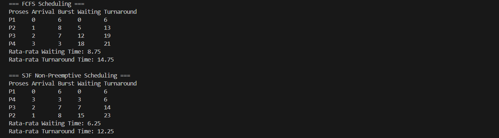

# Laporan Praktikum Minggu 9
Topik: Simulasi Algoritma Penjadwalan CPU

---

## Identitas
- **Nama**  : Faris Azhar  
- **NIM**   : 250202978
- **Kelas** : 1 IKRA

---

## A. Deskripsi Singkat
Pada praktikum minggu ini, mahasiswa akan **mengimplementasikan program simulasi sederhana algoritma penjadwalan CPU**, khususnya **FCFS dan SJF**.  
Berbeda dengan Minggu 5–6 yang berfokus pada perhitungan manual, pada minggu ini mahasiswa mulai **mengotomatisasi perhitungan menggunakan program**, menjalankan dataset uji, serta menyajikan hasil dalam bentuk tabel atau grafik.

Praktikum ini menjadi jembatan antara **pemahaman konseptual** dan **implementasi komputasional** algoritma sistem operasi.


## Tujuan
Setelah menyelesaikan tugas ini, mahasiswa mampu:
1. Membuat program simulasi algoritma penjadwalan FCFS dan/atau SJF.  
2. Menjalankan program dengan dataset uji yang diberikan atau dibuat sendiri.  
3. Menyajikan output simulasi dalam bentuk tabel atau grafik.  
4. Menjelaskan hasil simulasi secara tertulis.  
5. Mengunggah kode dan laporan ke Git repository dengan rapi dan tepat waktu.

---

## Dasar Teori
**1. Penjadwalan CPU**  
Penjadwalan CPU adalah proses memilih satu dari beberapa proses yang siap dieksekusi untuk dijalankan oleh CPU. Tujuannya adalah memaksimalkan efisiensi CPU dan mengoptimalkan waktu respons, throughput, dan waktu tunggu.

**2. Algoritma Penjadwalan**
- **FCFS (First-Come, First-Served)**  
  Proses dieksekusi sesuai urutan kedatangan. Sederhana, tetapi dapat menimbulkan *convoy effect* (proses pendek menunggu proses panjang selesai).  
- **SJF (Shortest Job First)**  
  Proses dengan *burst time* paling pendek dijalankan lebih dahulu. Dapat meminimalkan *average waiting time*, tetapi memerlukan prediksi lama eksekusi (*burst time*) proses.  

**3. Parameter Evaluasi**
- **Waiting Time (WT)**: Waktu yang dihabiskan proses dalam *ready queue* sebelum dieksekusi.  
- **Turnaround Time (TAT)**: Waktu total dari kedatangan proses hingga selesai.  
  Rumus: `TAT = WT + Burst Time`


---

Dataset Uji

| Proses | Arrival Time | Burst Time |
|:-----:|:------------:|:----------:|
| P1    | 0            | 6          |
| P2    | 1            | 8          |
| P3    | 2            | 7          |
| P4    | 3            | 3          |

Dataset ini digunakan untuk simulasi **FCFS dan SJF non-preemptive**.

---

## D. Implementasi Program

Program dibuat menggunakan **Python** dan berjalan di terminal.  
Langkah-langkah algoritma FCFS:
1. Urutkan proses berdasarkan **arrival time**.  
2. Hitung **waiting time** setiap proses:  
   `WT[i] = start_time[i] - arrival_time[i]`  
3. Hitung **turnaround time**:  
   `TAT[i] = WT[i] + Burst Time[i]`  
4. Tampilkan hasil dalam tabel.

Langkah-langkah algoritma SJF non-preemptive:
1. Pilih proses dengan **burst time terpendek** dari proses yang sudah *arrived*.  
2. Eksekusi proses terpilih hingga selesai.  
3. Hitung WT dan TAT seperti FCFS.  

---

## E. Hasil Simulasi

### Tabel Hasil FCFS

| Proses | Arrival | Burst | Waiting Time | Turnaround Time |
|:-----:|:-------:|:-----:|:------------:|:---------------:|
| P1    | 0       | 6     | 0            | 6               |
| P2    | 1       | 8     | 5            | 13              |
| P3    | 2       | 7     | 11           | 18              |
| P4    | 3       | 3     | 18           | 21              |

**Rata-rata Waiting Time:** (0+5+11+18)/4 = 8.5  
**Rata-rata Turnaround Time:** (6+13+18+21)/4 = 14.5

### Tabel Hasil SJF Non-Preemptive

| Proses | Arrival | Burst | Waiting Time | Turnaround Time |
|:-----:|:-------:|:-----:|:------------:|:---------------:|
| P1    | 0       | 6     | 0            | 6               |
| P4    | 3       | 3     | 3            | 6               |
| P3    | 2       | 7     | 6            | 13              |
| P2    | 1       | 8     | 13           | 21              |

**Rata-rata Waiting Time:** (0+3+6+13)/4 = 5.5  
**Rata-rata Turnaround Time:** (6+6+13+21)/4 = 11.5

> Screenshot hasil simulasi disimpan di folder 

---

## F. Analisis Hasil

1. FCFS sederhana, mengikuti urutan kedatangan, sehingga proses dengan burst panjang bisa menunda proses pendek (*convoy effect*).  
2. SJF menghasilkan **waiting time rata-rata lebih rendah**, karena proses pendek dijalankan lebih dulu.  
3. Perhitungan simulasi sama dengan perhitungan manual, validasi berhasil.  
4. Simulasi memudahkan analisis dataset besar yang sulit dihitung manual.


---

## Kode / Perintah
Tuliskan potongan kode atau perintah utama:

- Bahasa pemrograman **bebas** (Python / C / Java / lainnya).  
- Tidak wajib GUI, cukup **program berbasis terminal**.  
- Fokus penilaian pada **logika algoritma dan keakuratan hasil**, bukan kompleksitas bahasa.

Struktur folder (sesuaikan dengan template repo):
```
praktikum/week9-sim-scheduling/
├─ code/
│  ├─ scheduling_simulation.*
│  └─ dataset.csv
├─ screenshots/
│  └─ hasil_simulasi.png
└─ laporan.md
```

---

   


## E. Tugas & Quiz
### Tugas
### 1. Mengapa simulasi diperlukan untuk menguji algoritma scheduling?  
Simulasi memungkinkan analisis perilaku algoritma untuk dataset besar atau dinamis, yang sulit dihitung manual, sehingga dapat memprediksi kinerja sistem.

### 2. Apa perbedaan hasil simulasi dengan perhitungan manual jika dataset besar?  
Simulasi cepat dan akurat untuk dataset besar, sedangkan perhitungan manual rawan kesalahan dan memakan waktu lama.

### 3. Algoritma mana yang lebih mudah diimplementasikan? Jelaskan.  
FCFS lebih mudah diimplementasikan karena hanya membutuhkan pengurutan berdasarkan arrival time, tanpa perlu menghitung burst time secara dinamis seperti SJF.

4. Tulis laporan praktikum pada `laporan.md`.

## Kesimpulan
1. Simulasi algoritma penjadwalan CPU berhasil dibuat.  
2. FCFS mudah diimplementasikan, tetapi kurang optimal untuk waiting time.  
3. SJF dapat menurunkan rata-rata waiting time, tetapi memerlukan informasi burst time.  
4. Simulasi memberikan gambaran nyata efek urutan eksekusi terhadap kinerja CPU.

---


### Quiz
Jawab pada bagian **Quiz** di laporan:
1. Mengapa simulasi diperlukan untuk menguji algoritma scheduling?
2. Apa perbedaan hasil simulasi dengan perhitungan manual jika dataset besar?  
3. Algoritma mana yang lebih mudah diimplementasikan? Jelaskan.


